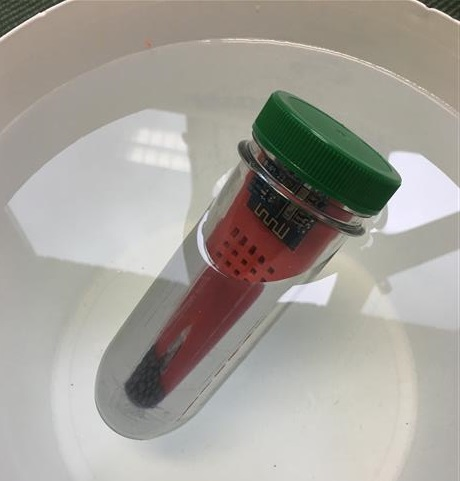
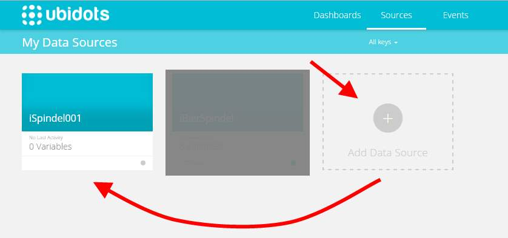
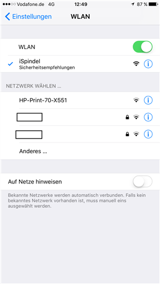
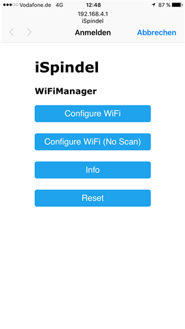

iSpindel
===================

**DIY elektronische Bierspindel | electronic Hydrometer**
***https://universam1.github.io/iSpindel***

***Unterstützung des Projekts*** 
[](https://www.paypal.me/universam)

> Update 28.11.16: Firmware v.2.0 - Ubidots Auto-Konfiguration  
> Update 28.11.16: Ubidots Einrichtung  
> Update 23.11.16: Schaltplan und Firmware


> Die ```iSpindel``` befindet sich zur Zeit mitten in der Entwicklung, siehe dazu [den Hobbybrauer.de Thread](http://hobbybrauer.de/forum/viewtopic.php?f=7&t=11235). Mitthilfe ist herzlich willkommen und Ergänzungen bitte per Pull Request einreichen. Großes Dank an alle die Unterstützung leisten seitens Grundlagen erarbeiten oder passende Hardware zu finden.




## Inhaltverzeichnis
- [Lizenz](#lizenz)
- [Prinzip](#prinzip)
  - [Metazentrum](#metazentrum)
- [Aufbau](#aufbau)
  - [Bauteile](#bauteile)
  - [Schaltplan](#schaltplan)
  - [Schlitten](#schlitten)
- [Konfiguration](#konfiguration)
  - [Ubitdots](#ubitdots)
  - [Portal](#portal)
- [Software](#software)


***

## Lizenz
> Jeglicher kommerzieller Nachbau oder Verwendung ist prinzipiell untersagt. Geltende Patente werden verletzt.
>
> All rights reserverd, any commercial use is hereby prohibited and will violate applicable patents.

***

## Prinzip

Angetrieben von dem Thread [Alternative zu Spindel](http://hobbybrauer.de/forum/viewtopic.php?f=7&t=11157&view=unread#p170499) wurde die Idee geboren die kommerziell erhältliche elektronische Bierspindel nachzubauen.

Die Idee des krängende Zylinders ist genial wie einfach - man braucht keine externe Referenz (außer der Erde) und der Zylinder ist extrem leicht sauber zu halten. Der Neigungswinkel ändert sich im Verhältnis zum Auftrieb und damit im direkten Zusammenhang mit dem Zuckergehalt.
Kein unnötiges Öffnen zum spindeln und evtl. Kontaminieren!


Daher die Idee, ein IoT device mit Wifi zusammen mit einem Beschleunigungssensor und Temperatursensor in einen schwimmenden Zylinder zu legen. Dort wacht er alle bsp. 5min auf, verbindet sich mit meinem Wlan und sendet seinen Neigungswinkel, Temperatur und Akkuspannung an einen Cloudservice. 

### *Metazentrum*

Eigentlich dreht es sich hier um das "Metazentrum", der Zylinder wird solange rotieren bis das Metazentrum im Lot zum Auftriebspunkt ist. Diesen Wert messen wir.

Man kann insofern trimmen, dass man am Boden ein paar Gramm hinzufügt, damit stellt sich der Zylinder mehr auf, oder am Deckel, damit krängt er mehr. 

In der Software berechnent man aus den XYZ Beschleunigungswerten den Euler Winkel für X und Y und bildet daraus den Absolutwinkel. Diesen verrechnen wir mit den kalibrierten Eckwerten zum °Plato.


***

## Aufbau

>***ACHTUNG: dies entspricht Stand 20.11.2016***

### Bauteile

- [Wemos D1 mini](https://www.wemos.cc/product/d1-mini.html)
- ```GY-521``` Gyro & Beschleunigungssensor (MPU-6050 auf passendem breakout Board)
- [DS18B20 Temperatursensor](https://www.maximintegrated.com/en/products/analog/sensors-and-sensor-interface/DS18B20.html)
- Lochrasterplatine 3x4cm
- Widerstände
  - 4k7 Ohm
  - 220k Ohm
  - 470 Ohm
- Mikro Schalter
- ```18650 LiIo Zelle``` (z.B. ```Panasonic NCR18650B``` **geschützt** oder ohne **PCB**) ***UNGETESTED***
- Lipo Lademodul ```TP4056``` ***UNGETESTED***
- Kunstoff Schlitten (Vorlage zum 3D drucken im repo)
  - alternativ (Lochraster) Platine ***UNGETESTED***)

- Kunstoff Zylinder ```Petling```

> ## Info
> Der Anbieter [cachers-world.de](http://cachers-world.de/de/Petling-XL) unsterstützt dieses Projekt indem er nachhaltig den passenden Petling liefern möchte und über den Gutschein-Code "```HOBBYBRAUER```"  (Großschreibung!) 20% Rabatt gewährt. 
Dieser [Petling-XL](http://cachers-world.de/de/Petling-XL) passt zu dem 3D gedruckten Schlitten.
>
>Info: *"Ist im Moment dann nur 1,44 EUR ab 2017 werden es dann 1,52 EUR sein, weil der Artikel 10ct hoch geht."*

>Info 2: Zur Zeit ausverkauft, nachbestellt.

***
### Schaltplan

***siehe [Schaltplan](docs/Schaltplan.md)***

***

### Schlitten


<a href="http://www.youtube.com/watch?feature=player_embedded&v=gpVarh8BxhQ" target="_blank"></a>


***

## Konfiguration

### Ubitdots

- Zu Beginn muss ein kostenloser Account bei [Ubidots.com](https://ubidots.com) erstellt werden
- Im Menü  ```API Credentials``` erhält man seinen ```Token``` durch das die iSpindel die Berechtigung zum Schreiben der Daten erhält.  
***Diesen notieren.***  
  

> Update 28.11.16: Durch Auto - Konfiguration sind folgende Schritte nicht mehr nötig

- ~~In diesem Account erstellt man nun ein neues ```Data Source``` und benennt seine iSpindel bsp. "iSpindel001"~~ 

  

- ~~In diesem Device erstellt man nun 3  ```Variable``` das den 3 Datenquellen entspricht die geliefert werden~~
  - ~~Neigung (wird später zu °Plato umgerechnet)~~
  - ~~Temperatur (fließt auch in °Plato ein)~~
  - ~~Batterie Spannung~~ 

  ~~***Notieren dieser 3 ```ID's``` die man über das  ```i``` Icon erhält***~~

  ~~


### Portal

Durch mehrmaliges Drücken der ```Reset Taste``` erstellt der Wemos einen AccessPoint, mit dem verbunden man die nötigen Einstellugen vornehmen kann.

> Die ```iSpindel``` signalisiert dass sie sich im *Konfiguration-Modus* druch permanentes Blinken im Sekundentakt.  
Man verlässt den *Konfiguration-Modus* durch speichern seiner Einstellungen, durch betätigen des Menüpunkts ```Start iSpindel``` oder durch warten von 5 Minuten. Danach befindet sie sich im *Betriebsmodus* d.h. sie sendet ihre Daten und geht daraufhin direkt in den "Deep Sleep" Standby Modus. Daher ist sie im normalen Modus nicht erreibar.

- Der Ubidots  ```Token``` ~~und die  ```IDs```~~, welche man oben notiert hat, werden nun an dieser Stelle eingetragen.  

- Ebenfalls stellt man hier den ```Intervall``` ein in dem sie Daten liefert. Dies hat direkt mit der Akku Lebensdauer zu tun. Es empfiehlt sich in der Praxis etwa ```1800``` Sekunden (= 30 Minuten) Takt zu wählen.

   


- Man erreicht es über

   


- Eine Übersicht der Daten kann man über den ```Info``` Menüpunkt einsehen

  

> Nach dem man obige Daten eingetragen und gespeichert hat, wird die Spindel sich mit dem Wlan und Ubidots verbinden und die Daten übertragen.  
Auf der Ubidots Weboberfläche wird man nun unter ```Sources``` sehen dass die Daten aktualisiert werden.  
Nun kann man im ```Dashboard``` sich seine Graphen nach Belieben zusammenstellen.

***

## Software 

### Firmware flashen

[Firmware flashen](docs/Firmware.md)

### Benutzte Bibliotheken

- https://github.com/tzapu/WiFiManager zum Herstellen der Verbindung (verändert)
- https://github.com/bblanchon/ArduinoJson

***Gefällt es dir, na dann spende mir halt ein Bier***  :beers:

[](https://www.paypal.me/universam)

