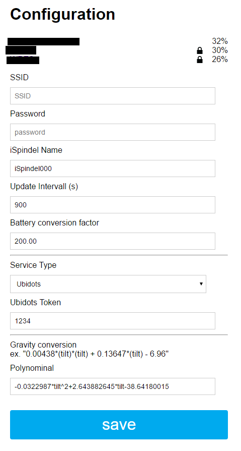
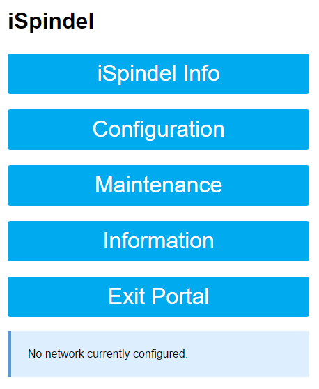
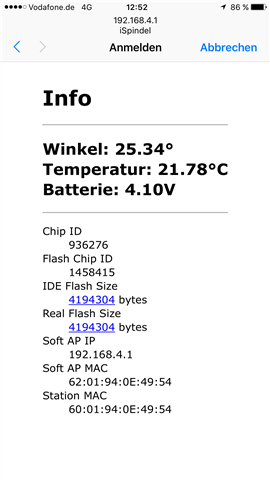

# iSpindel - *DIY electronic Hydrometer*

**[www.ispindel.de](http://www.ispindel.de)**

***

***

***

## Featured in german brewing magazine [Braumagazin.de](http://braumagazin.de/?issue=2018-01)

***

If you like that project please vote for the [Hackaday.io *2017 Prize List*](https://hackaday.io/project/20421-ispindel)

Check out [IOT DEVICE PULLS ITS WEIGHT IN HOME BREWING](http://hackaday.com/2017/03/01/iot-device-pulls-its-weight-in-home-brewing/)

## Documentation in other languages

### [English Documentation (work in progress)](docs/README_en.md) 🇺🇸

### [Nederlandse Vertaling (lopende werkzaamheden)](docs/README_nl.md) 🇳🇱

### [Documentação em Português (trabalho em andamento)](docs/README_pt.md) 🇧🇷

***

***Say thanks with a beer*** :beers:

***

## [Firmware download here](https://github.com/universam1/iSpindel/releases)

***

## ChangeLog

| Date       | Note                                                                                                                                                                                                                                                                                                                                                                                                                                                                                                                                                                                                                                                                                                                                                                                        |
| :--------- | :------------------------------------------------------------------------------------------------------------------------------------------------------------------------------------------------------------------------------------------------------------------------------------------------------------------------------------------------------------------------------------------------------------------------------------------------------------------------------------------------------------------------------------------------------------------------------------------------------------------------------------------------------------------------------------------------------------------------------------------------------------------------------------------ |
| 04.02.21   | Firmware 6.5.1: New tilt equation, support for Brewblox via MQTT, improved calibration tools - thanks for contributions @tomsykes @bdelbosc @vitotai @thegreatgunbantoad and many others                                                                                                                                                                                                                                                                                                                                                                                                                                                                                                                                                                                                    |
| 17.11.19   | Firmware 6.2.0: New Calibration routine: The calibration procedure takes now less than 5s only to determine offsets that set the current position of the Accelerometer close as possible to level! Also this new implementation solves a few issues reported where the values have not been saved reliably.   Also, the configuration file routine has been improved to support larger strings that were clipped at some point                                                                                                                                                                                                                                                                                                                                                              |
| 10.11.19   | Firmware 6.1.3: Extending the length of URL parameter to support API Gateway URLs. Fixes of incompatibilities from #308. Support for latest ESP8266 SDK solving naming collisions                                                                                                                                                                                                                                                                                                                                                                                                                                                                                                                                                                                                           |
| 8.11.19    | Firmware 6.1.2: hardening SPIFFS config save routine                                                                                                                                                                                                                                                                                                                                                                                                                                                                                                                                                                                                                                                                                                                                        |
| 27.10.19   | Firmware 6.1.1: Added support for ThingSpeak (#305) (#308), improving documentation, fix for prometheus sender data (#303), updating to new PIO output path                                                                                                                                                                                                                                                                                                                                                                                                                                                                                                                                                                                                                                 |
| 27.10.19   | Firmware 6.1.0:  migrating to ArduinoJSON v6                                                                                                                                                                                                                                                                                                                                                                                                                                                                                                                                                                                                                                                                                                                                                |
| 27.10.19   | Firmware 6.0.6:  expand size to support longer urls                                                                                                                                                                                                                                                                                                                                                                                                                                                                                                                                                                                                                                                                                                                                         |
| 7.3.2019   | Firmware 6.0.5: Fix Javascript issue with selection of the Service Type                                                                                                                                                                                                                                                                                                                                                                                                                                                                                                                                                                                                                                                                                                                     |
| 19.12.2018 | Firmware 6.0.4: Higher precision for polynominal possible                                                                                                                                                                                                                                                                                                                                                                                                                                                                                                                                                                                                                                                                                                                                   |
| 19.12.2018 | Firmware 6.0.3: Higher precision for gravity displayed in status page                                                                                                                                                                                                                                                                                                                                                                                                                                                                                                                                                                                                                                                                                                                       |
| 24.10.2018 | Firmware 6.0.2: Display issues on MacOS resolved                                                                                                                                                                                                                                                                                                                                                                                                                                                                                                                                                                                                                                                                                                                                            |
| 22.08.2018 | **Firmware 6.0.0**: 1. Alternative pin for OneWire tempearuture sensor DS18B20 now possible. This allows a different PCB schema to use either pin `D1` or `D6`.  2. Auto detection of OneWire pin, successfull detected pin will be saved together with a config `save` action.   Output of detailed debug information of OneWire Sensor during searches, helping those with hardware issues.  3. Increased battery lifetime of about 20% by reducing the runtime to ~2200ms through various tunings. 4. Using *Interrupts* instead of delays to read the Accelerometer, allows significant shorter read intervals  5. Shorter read cycles allow  *more precision*, increased samples from 7 to 39 samples that still fit into the necessary wait state for the Temp sensor! |
| 16.08.2018 | Firmware 5.9.1: Fixing Ubidots issue and extending MQTT                                                                                                                                                                                                                                                                                                                                                                                                                                                                                                                                                                                                                                                                                                                                     |
| 09.08.2018 | Firmware 5.9.0: Support for MQTT, InfluxDB (Thanks to jmelhus, iceaway and thorrak)                                                                                                                                                                                                                                                                                                                                                                                                                                                                                                                                                                                                                                                                                                         |
| 13.05.2018 | Firmware 5.8.6: allow longer fields for polynominal, SSID and Password                                                                                                                                                                                                                                                                                                                                                                                                                                                                                                                                                                                                                                                                                                                      |
| 15.03.2018 | Firmware 5.8.5: adding support for Prometheus Pushgateway, thanks to @jankeesv                                                                                                                                                                                                                                                                                                                                                                                                                                                                                                                                                                                                                                                                                                              |
| 08.03.2018 | Firmware 5.8.4: adding support for logging temperature data in Fahrenheit and Kelvin, thanks to @iceaway                                                                                                                                                                                                                                                                                                                                                                                                                                                                                                                                                                                                                                                                                    |
| 05.03.2018 | Firmware 5.8.3: Support for InfluxDB as additional backend, thanks to @iceaway                                                                                                                                                                                                                                                                                                                                                                                                                                                                                                                                                                                                                                                                                                              |
| 23.02.2018 | New drawer version 'mwx-Edition' using threaded bolt nut and washer - thanks to @mwx                                                                                                                                                                                                                                                                                                                                                                                                                                                                                                                                                                                                                                                                                                        |
| 21.02.2018 | Firmware 5.8.2: Extend token size to 40 char to support longer Ubidots token                                                                                                                                                                                                                                                                                                                                                                                                                                                                                                                                                                                                                                                                                                                |
| 14.02.2018 | Firmware 5.8.1: HTML encode special character in configuration forms, allows displaying the passwort correctly                                                                                                                                                                                                                                                                                                                                                                                                                                                                                                                                                                                                                                                                              |
| 09.02.2018 | Firmware 5.8.0: Transmitting the Wifi strength RSSI to insight of the reception                                                                                                                                                                                                                                                                                                                                                                                                                                                                                                                                                                                                                                                                                                             |
| 07.02.2018 | Firmware 5.7.1: Allow longer sleep intervals longer up to 99999s == 27 days                                                                                                                                                                                                                                                                                                                                                                                                                                                                                                                                                                                                                                                                                                                 |
| 03.02.2018 | Firmware 5.7.0: Introduce Factory Reset feature                                                                                                                                                                                                                                                                                                                                                                                                                                                                                                                                                                                                                                                                                                                                             |
| 02.02.2018 | Firmware 5.6.2: Support for Wifi credentials with special characters                                                                                                                                                                                                                                                                                                                                                                                                                                                                                                                                                                                                                                                                                                                        |
| 07.11.2017 | Firmware 5.6.1: Restoring Wifi credentials, moved to HTTP client library, improved RFCAL resilience to gain more stable Wifi connection                                                                                                                                                                                                                                                                                                                                                                                                                                                                                                                                                                                                                                                     |
| 17.10.2017 | Firmware 5.5.4: Various fixes for CraftBeerPi, BrewPiLess and Ubidots                                                                                                                                                                                                                                                                                                                                                                                                                                                                                                                                                                                                                                                                                                                       |
| 28.09.2017 | Firmware 5.5.0: Recall saved Wifi credential thus persisting over configuration changes                                                                                                                                                                                                                                                                                                                                                                                                                                                                                                                                                                                                                                                                                                     |
| 31.08.2017 | iSpindle.py Version 1.3.1: genericTCP Update (local server & prep for public server); Firmware 5.4.2: Memory improvements.                                                                                                                                                                                                                                                                                                                                                                                                                                                                                                                                                                                                                                                                  |
| 29.08.2017 | Firmware 5.4.1: Rewrite of the upload class to streamline and allow further data items. Also add iSpindel.de as data server as preset.                                                                                                                                                                                                                                                                                                                                                                                                                                                                                                                                                                                                                                                      |
| 08.08.2017 | [calibration tool](http://www.ispindel.de/tools/calibration/calibration.htm) to calculate gravity as alternative to the Excel sheet                                                                                                                                                                                                                                                                                                                                                                                                                                                                                                                                                                                                                                                         |
| 05.07.2017 | Workaround for BrewPiLess                                                                                                                                                                                                                                                                                                                                                                                                                                                                                                                                                                                                                                                                                                                                                                   |
| 30.06.2017 | Mentioned in http://preview.mailerlite.com/g6n5p3/660851237247259035/r2w6/                                                                                                                                                                                                                                                                                                                                                                                                                                                                                                                                                                                                                                                                                                                  |
| 22.05.2017 | updated build docs                                                                                                                                                                                                                                                                                                                                                                                                                                                                                                                                                                                                                                                                                                                                                                          |
| 22.05.2017 | switching build environment to platform.io                                                                                                                                                                                                                                                                                                                                                                                                                                                                                                                                                                                                                                                                                                                                                  |
| 01.05.2017 | Major Firmware update to 5! Calculate the Gravity now within the iSpindel by expression evaluation! The conversion polynom can be stored per iSpindel and sends as an additional metric (without a unit). Therefore, whether Plato or SG is prefered is up to the user defined polynom. There are two variable available `tilt` and `temp`. Zero point calibration. Firmware update OTA over the Air                                                                                                                                                                                                                                                                                                                                                                                        |
| 12.04.2017 | Mentioned in http://www.homebrewtalk.com/showthread.php?t=598187                                                                                                                                                                                                                                                                                                                                                                                                                                                                                                                                                                                                                                                                                                                            |
| 01.03.2017 | Mentioned in hackaday.com http://hackaday.com/2017/03/01/iot-device-pulls-its-weight-in-home-brewing/                                                                                                                                                                                                                                                                                                                                                                                                                                                                                                                                                                                                                                                                                       |
| 23.02.2017 | English documentation added                                                                                                                                                                                                                                                                                                                                                                                                                                                                                                                                                                                                                                                                                                                                                                 |
| 14.02.2017 | English documentation added                                                                                                                                                                                                                                                                                                                                                                                                                                                                                                                                                                                                                                                                                                                                                                 |
| 09.02.2017 | Firmware 4.1.6                                                                                                                                                                                                                                                                                                                                                                                                                                                                                                                                                                                                                                                                                                                                                                              |
| 31.01.2017 | Bilder Aufbau Platinenvariante                                                                                                                                                                                                                                                                                                                                                                                                                                                                                                                                                                                                                                                                                                                                                              |
| 26.01.2017 | Firmware 4.0: inifinte sleep time developed: the maximum 71min RTC time extends through step-sleeps . Wifi RF calibration introduced when calling configuration. fixed bug of emergency interval. fixed UI numeric formating                                                                                                                                                                                                                                                                                                                                                                                                                                                                                                                                                                |
| 25.02.2017 | Firmware 3.5.0: genericTCP: Python Skript um lokal die Daten in eine CSV Datei zu schreiben (thanks to Tozzi)                                                                                                                                                                                                                                                                                                                                                                                                                                                                                                                                                                                                                                                                               |
| 23.12.2016 | CraftBeerPi Info, FW.3.4.4, Combo-Schlitten                                                                                                                                                                                                                                                                                                                                                                                                                                                                                                                                                                                                                                                                                                                                                 |
| 18.12.2016 | FAQ und Ubidots tool                                                                                                                                                                                                                                                                                                                                                                                                                                                                                                                                                                                                                                                                                                                                                                        |
| 15.11.2016 | Firmware 3.4.2: Supporting now backends: CraftBeerPi, TControl,FHEM, generic HTTP. major Portal rework, added labels for convenience, upload speed improvements, Power saving on empty battery, added custom Battery conversion factor, Bugfixes                                                                                                                                                                                                                                                                                                                                                                                                                                                                                                                                            |
| 11.12.2016 | Sources and drawer online                                                                                                                                                                                                                                                                                                                                                                                                                                                                                                                                                                                                                                                                                                                                                                   |
| 11.12.2016 | FHEM upload documentation & firmware (thanks @MSBannert!)                                                                                                                                                                                                                                                                                                                                                                                                                                                                                                                                                                                                                                                                                                                                   |
| 07.12.2016 | Schematics                                                                                                                                                                                                                                                                                                                                                                                                                                                                                                                                                                                                                                                                                                                                                                                  |
| 03.12.2016 | Firmware 2.1.2 Wifi improvements                                                                                                                                                                                                                                                                                                                                                                                                                                                                                                                                                                                                                                                                                                                                                            |
| 09.11.2016 | Calibration and Excel sheet for conversion to Plato, SG etc.                                                                                                                                                                                                                                                                                                                                                                                                                                                                                                                                                                                                                                                                                                                                |

***

> Contribution and support is appreciated especially regarding creation and translation of documentation. Feel free to provide a `pull request`.  
>
> Die `iSpindel` befindet sich in andauernder Entwicklung, siehe dazu [den Hobbybrauer.de Thread](http://hobbybrauer.de/forum/viewtopic.php?f=7&t=11235). Mithilfe ist herzlich willkommen und Ergänzungen bitte per Pull Request einreichen. Großes Dank an alle die Unterstützung leisten seitens Grundlagen erarbeiten oder passende Hardware zu finden.

## Inhaltverzeichnis

- [iSpindel - *DIY electronic Hydrometer*](#ispindel-diy-electronic-hydrometer)
  - [Featured in german brewing magazine Braumagazin.de](#featured-in-german-brewing-magazine-braumagazinde)
  - [Documentation in other languages](#documentation-in-other-languages)
    - [English Documentation (work in progress) 🇺🇸](#english-documentation-work-in-progress-)
    - [Nederlandse Vertaling (lopende werkzaamheden) 🇳🇱](#nederlandse-vertaling-lopende-werkzaamheden-)
    - [Documentação em Português (trabalho em andamento) 🇧🇷](#documentação-em-português-trabalho-em-andamento-)
  - [Firmware download here](#firmware-download-here)
  - [ChangeLog](#changelog)
  - [Inhaltverzeichnis](#inhaltverzeichnis)
  - [Lizenz](#lizenz)
  - [Prinzip](#prinzip)
    - [*Metazentrum*](#metazentrum)
  - [Aufbau](#aufbau)
    - [Varianten](#varianten)
    - [Bauteile](#bauteile)
    - [Schaltplan](#schaltplan)
    - [Schlitten](#schlitten)
  - [Konfiguration](#konfiguration)
    - [Ubidots](#ubidots)
    - [Portal](#portal)
    - [Scripting](#scripting)
  - [Anzeige](#anzeige)
    - [Ubidots Graphen](#ubidots-graphen)
    - [CraftBeerPi](#craftbeerpi)
    - [FHEM](#fhem)
    - [iSpindel-TCP-Server](#ispindel-tcp-server)
  - [Kalibrierung](#kalibrierung)
  - [Software](#software)
    - [Firmware flashen](#firmware-flashen)
    - [Compile from Source](#compile-from-source)

***

## Lizenz

> Jeglicher kommerzieller Nachbau oder Verwendung ist prinzipiell untersagt. Geltende Patente werden verletzt.
>
> All rights reserverd, any commercial use is hereby prohibited and will violate applicable patents.

***

## Prinzip

Die Messung der Dichte von Wasser mit Hilfe des krängenden Zylinders ist so einfach wie genial - man braucht keine externe Referenz (außer der Erde) und der Zylinder ist extrem leicht sauber zu halten. Der Neigungswinkel ändert sich im Verhältnis zum Auftrieb und damit im direkten Zusammenhang mit dem Zuckergehalt.
Kein unnötiges Öffnen zum spindeln und evtl. Kontaminieren!

Daher die Idee, ein IoT device mit Wifi zusammen mit einem Beschleunigungssensor und Temperatursensor in einen schwimmenden Zylinder zu legen. Dort wacht er alle bsp. 5min auf, verbindet sich mit meinem Wlan und sendet seinen Neigungswinkel, Temperatur und Akkuspannung an einen Cloudservice wie [Ubidots](www.ubidots.com) oder einen lokalen Server.

### *Metazentrum*

Eigentlich dreht es sich hier um das "Metazentrum", der Zylinder wird solange rotieren bis das Metazentrum im Lot zum Auftriebspunkt ist. Diesen Wert messen wir.

Man kann insofern trimmen, dass man am Boden ein paar Gramm hinzufügt, damit stellt sich der Zylinder mehr auf, oder am Deckel, damit krängt er mehr. 

In der Software berechnent man aus den XYZ Beschleunigungswerten den Euler Winkel für X und Y und bildet daraus den Absolutwinkel. Diesen verrechnen wir mit den kalibrierten Eckwerten zum °Plato.

***

## Aufbau

### Varianten

> Alle drei Varianten sind funktionell identisch

1. [Variante A: Lochrasterplatine & Schlitten](docs/iSpindelbreadboard.md)  
Die Lochrasterplatine ermöglicht den Nachbau jederzeit mit 'Hausmitteln' 
1. [Variante B: nur Platine](docs/iSpindelPCB.md)  
Die fertige Platine über die Sammelbestellung bringt einen komfortablen Aufbau
1. [Variante C: Platine & Schlitten](docs/iSpindelPCB.md)  
Die obige Platine kann (über Trenn-Schnitt) mit dem Kunstoff Schlitten in Kombination verwendet werden der einen spielfreien Sitz garantiert.

### Bauteile

***siehe [Bauteile](docs/Parts.md)***

### Schaltplan

***siehe [Schaltplan](docs/Schaltplan.md)***

### Schlitten

***siehe [Bauteile](docs/Parts.md)***

***

## Konfiguration

### Ubidots

- Zu Beginn muss ein kostenloser Account bei [Ubidots.com](https://ubidots.com) erstellt werden
- Im Menü  `API Credentials` erhält man seinen `Token` durch das die iSpindel die Berechtigung zum Schreiben der Daten erhält.  
***Diesen notieren.***  

### Portal

Durch mehrmaliges Drücken der `Reset Taste` erstellt der Wemos einen AccessPoint, mit dem verbunden man die nötigen Einstellugen vornehmen kann.

> Die `iSpindel` signalisiert dass sie sich im *Konfiguration-Modus* druch permanentes Blinken im Sekundentakt.  
Man verlässt den *Konfiguration-Modus* durch speichern seiner Einstellungen, durch betätigen des Menüpunkts `Start iSpindel` oder durch warten von 5 Minuten. Danach befindet sie sich im *Betriebsmodus* d.h. sie sendet ihre Daten und geht daraufhin direkt in den "Deep Sleep" Standby Modus. Daher ist sie im normalen Modus nicht erreibar.

- Der Ubidots  `Token` ~~und die  `IDs`~~, welche man oben notiert hat, werden nun an dieser Stelle eingetragen.  

- Ebenfalls stellt man hier den `Intervall` ein in dem sie Daten liefert. Dies hat direkt mit der Akku Lebensdauer zu tun. Es empfiehlt sich in der Praxis etwa `1800` Sekunden (= 30 Minuten) Takt zu wählen.

   

- Man erreicht es über

   

- Eine Übersicht der Daten kann man über den `Info` Menüpunkt einsehen

  

Nach dem man obige Daten eingetragen und gespeichert hat, wird die Spindel sich mit dem Wlan und Ubidots verbinden und die Daten übertragen.  
Falls noch nicht vorhanden, wird selbständig ein neues `Device` erstellt und die Sensoren angelegt.  
Auf der Ubidots Weboberfläche wird man nun unter `Sources` sehen dass die Daten aktualisiert werden.  

Nun kann man im `Dashboard` sich seine Graphen nach Belieben zusammenstellen.

### Scripting

Ubidots kann ausserdem an vielen Stellen per Script bedient werden. Eine Dokumentation zu den Funktionen findet sich direkt bei Ubidots. Hiermit können zum Beispiel nicht mehr benötigte Daten in Variablen gelöscht werden.

- [siehe Ubidots-Scripting](docs/ubidotsscripting.md)

***
## Anzeige

Die `iSpindel` kann ihre Daten an verschieden backends senden. Es empfiehlt sich mit dem Cloudservice [Ubidots](www.Ubidots.com) zu beginnen, dort kann man sich einen kostenlosen Account erstellen und die Graphen sich darstellen. Man kann auch weitere Abwandlungen der Daten vornehmen, wie den Plato / SG Wert errechnen, den EVG usw.
Folgende backends werden mittlerweile unterstützt:

### Ubidots Graphen

- [Plato Formel](docs/Kalibrierung.md#formel)

### CraftBeerPi

> Beschreibung von @not:  
*Wenn Du die neueste Firmware auf Deine iSpindel geflasht hast musst Du auch craftbeerpi updaten: dazu brauchst Du den branch "hydrometer". Wenn Du die Spindel dann konfigurierst, gibst Du neben den Einstellungen für Dein WLAN im Dropdown-Menu "CraftbeerPi" an und darunter die IP Adresse Deines im selben Netzwerk gelegenen Craftbeerpi-Servers.
Danach sendet die Spindel an den Raspberry Pi -Rechner und Craftbeerpi registriert die Spindel automatisch . Wenn die Verbindung klappt, findest Du die Spindel "wie von Geisterhand" in der Hardware-Konfiguration von CBP.
Du siehst, dass Daten ankomen, wenn Du Deine Fermentation / Gärung im CBP anschaust, da sind dann nicht nur die Temperatur (ist und soll) , sondern auch Spindeltemperatur und Plato zu sehen (siehe Screenshot oben) mit letztem Zeitstempel.*  
`git clone -b hydrometer https://github.com/Manuel83/craftbeerpi.git`

### FHEM

- [upload zu FHEM](docs/upload-FHEM.md)

### iSpindel-TCP-Server

- [https://github.com/DottoreTozzi/iSpindel-TCP-Server](https://github.com/DottoreTozzi/iSpindel-TCP-Server)

***

## Kalibrierung

Zur Umrechnung von dem gemessenen **Winkel ° in °Plato, SG, %mas** o.ä. ist es initial nötig eine Referenzkurve zu kalibrieren. 
Die gewonnenen Referenzen können dann über eine Excel Tabelle oder das [Online Gravity Calibration tool](http://www.ispindel.de/tools/calibration/calibration.htm) in eine Funktion überführt werden, die zur Darstellung hinterlegt wird. 

Da jede selbstgebaute Spindel andere Messwerte ergeben wird, muss man diesen Prozess einmalig pro iSpindel durchführen.

[siehe Kalibrierung durchführen](docs/Kalibrierung.md)

***

## Software 

### Firmware flashen

- [Firmware flashen](docs/Firmware.md)

### Compile from Source

- [Compile from source](docs/compile.md)

***Gefällt es dir, na dann spende mir halt ein Bier***  :beers:

