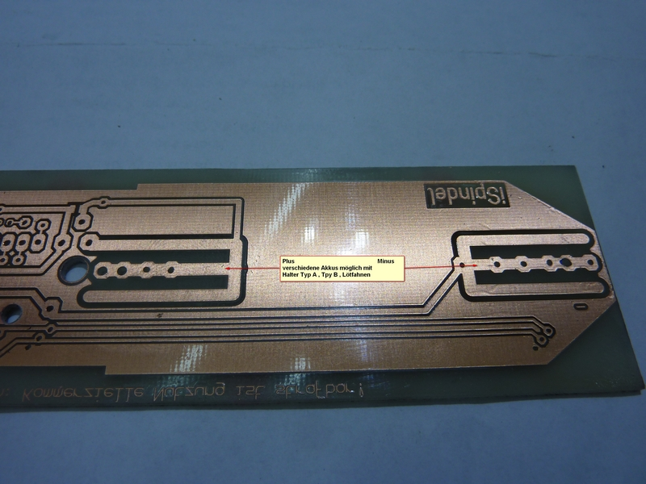
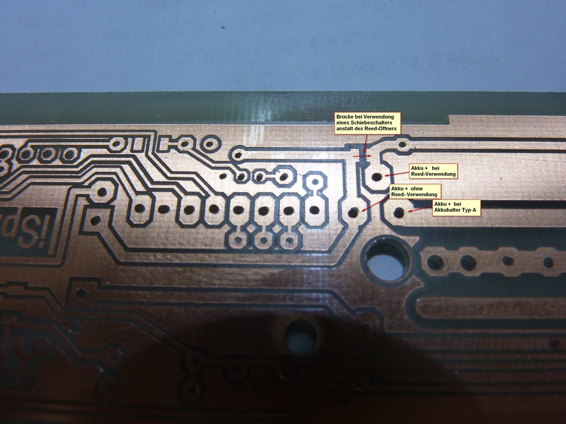
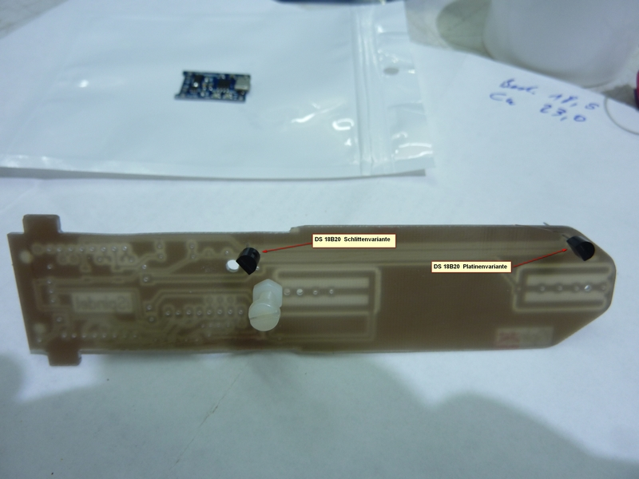
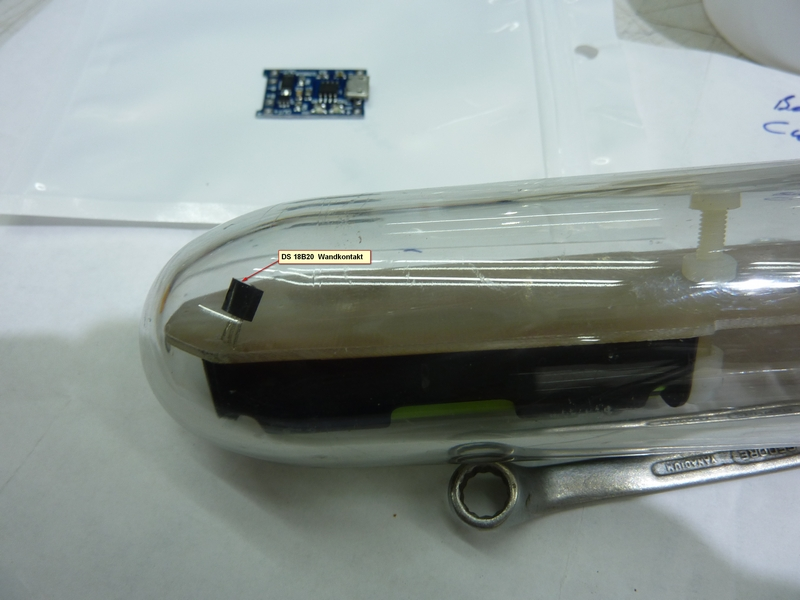
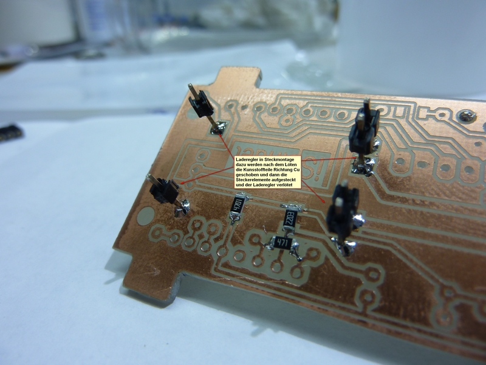
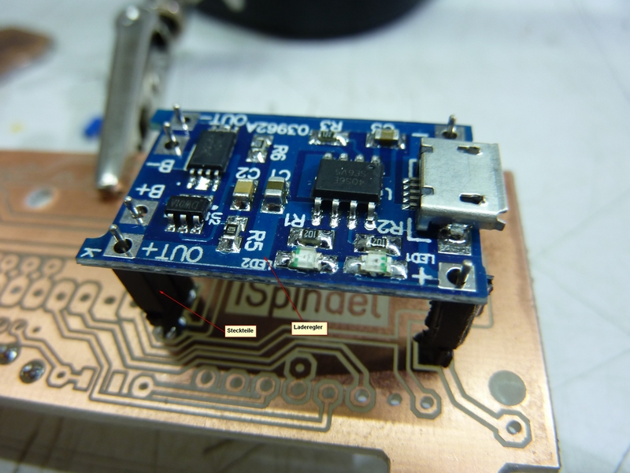
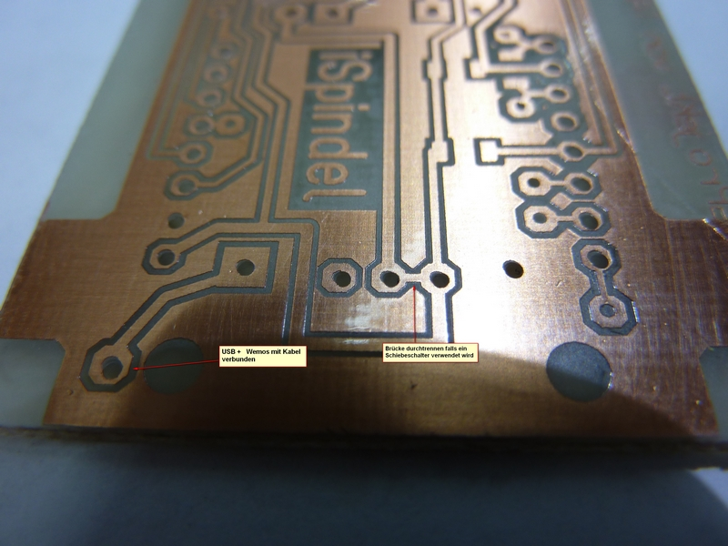

# Aufbau Platine mit / ohne Schlitten

## Variante C: Platine & Schlitten

Um die Platine mit dem Schlitten zu verwenden, folgende Dinge berücksichtigen:
- Die Platine hat eine vorgesehene Schnittkante, in Höhe des Lochs der Schraube, an dieser abtrennen.
- Der DS18B20 wird folglich neben dem GY-521 angelötet
- Der Akku wird an BAT+ und BAT- des TP4056 angelötet

Die Platine in den Falz einschieben, so dass der Wemos sich auf der Akku abgewandten Seite befindet (im schwimmenden Zustand oben).

## Variante B: nur Platine

***TODO: Beschreibung***

### Bilder

