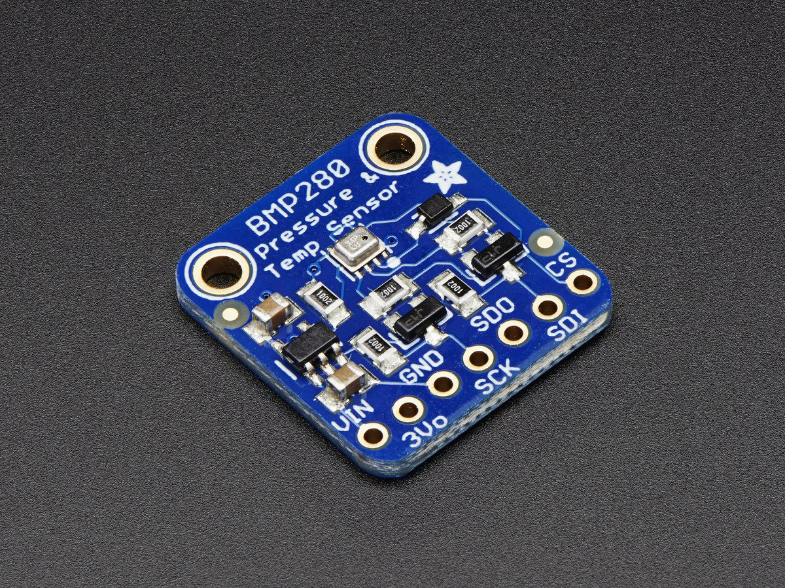

# Adafruit BMP280 Driver (Barometric Pressure Sensor) 

This driver is for the [Adafruit BMP280 Breakout](http://www.adafruit.com/products/2651)

## About the BMP280 ##

This precision sensor from Bosch is the best low-cost sensing solution for measuring barometric pressure and temperature. Because pressure changes with altitude you can also use it as an altimeter!

## About this Driver ##

Adafruit invests time and resources providing this open source code.  Please support Adafruit and open-source hardware by purchasing products from Adafruit!

Written by Kevin (KTOWN) Townsend for Adafruit Industries.

<!-- START COMPATIBILITY TABLE -->

## Compatibility

MCU                | Tested Works | Doesn't Work | Not Tested  | Notes
------------------ | :----------: | :----------: | :---------: | -----
Atmega328 @ 16MHz  |      X       |             |            |
Atmega328 @ 12MHz  |      X       |             |            |
Atmega32u4 @ 16MHz |      X       |             |            | Use SDA/SCL on pins D2 &amp; D3
Atmega32u4 @ 8MHz  |      X       |             |            | Use SDA/SCL on pins D2 &amp; D3
ESP8266            |      X       |             |            | SDA/SCL default to pins 4 &amp; 5 but any two pins can be assigned as SDA/SCL using Wire.begin(SDA,SCL)
Atmega2560 @ 16MHz |      X       |             |            | Use SDA/SCL on pins 20 &amp; 21
ATSAM3X8E          |      X       |             |            | Use SDA/SCL on pins 20 &amp; 21
ATSAM21D           |      X       |             |            |
ATtiny85 @ 16MHz   |             |      X       |            |
ATtiny85 @ 8MHz    |             |      X       |            |
Intel Curie @ 32MHz |             |             |     X       |
STM32F2            |             |             |     X       |

  * ATmega328 @ 16MHz : Arduino UNO, Adafruit Pro Trinket 5V, Adafruit Metro 328, Adafruit Metro Mini
  * ATmega328 @ 12MHz : Adafruit Pro Trinket 3V
  * ATmega32u4 @ 16MHz : Arduino Leonardo, Arduino Micro, Arduino Yun, Teensy 2.0
  * ATmega32u4 @ 8MHz : Adafruit Flora, Bluefruit Micro
  * ESP8266 : Adafruit Huzzah
  * ATmega2560 @ 16MHz : Arduino Mega
  * ATSAM3X8E : Arduino Due
  * ATSAM21D : Arduino Zero, M0 Pro
  * ATtiny85 @ 16MHz : Adafruit Trinket 5V
  * ATtiny85 @ 8MHz : Adafruit Gemma, Arduino Gemma, Adafruit Trinket 3V

<!-- END COMPATIBILITY TABLE -->
